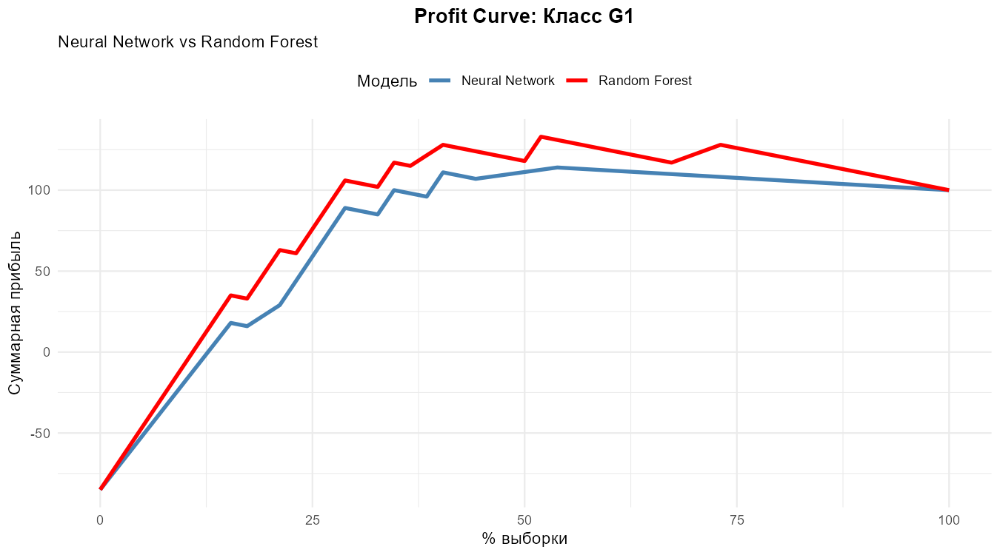
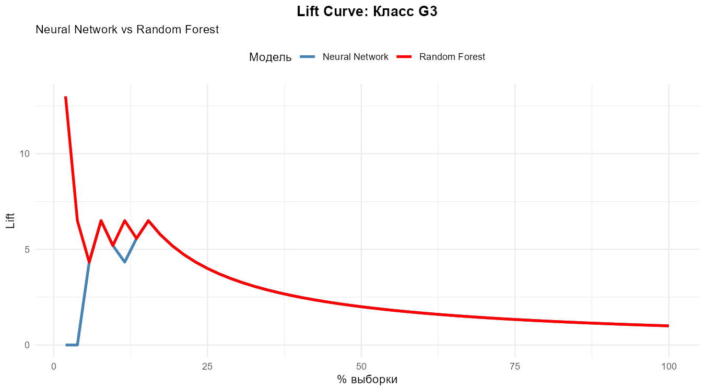

# Предиктивный контроль качества стекла по химическому составу

Автоматическая классификация 7 типов стекла по химическому составу для систем контроля качества на стекольном производстве.

## Результаты

**Лучшая модель:** Random Forest
- Accuracy: 80.5%
- Kappa: 0.73
- Lift на редких классах (G3): 13.0

## Ключевая фишка: Profit Curve

Большинство аналитиков оценивают модели по Accuracy/F1, Однако можно пойти дальше — построить **Profit Curve** с учётом стоимости ошибок:
- True Positive: +10 у.е.
- False Positive: −2 у.е.
- False Negative: −5 у.е.

**у.е.** - условные единицы, которые вы получаете или теряете в том или ином случае.

Это позволяет определить **оптимальный порог классификации**, максимизирующий прибыль, а не просто точность.

## Технологии

R, caret, tidyverse, ggplot2, randomForest, e1071, nnet, kernlab, patchwork

## Структура

```
01-glass-classification/
├── README.md              ← Вы здесь
├── analysis.Rmd           ← Исходный код анализа (R Markdown)
├── analysis.html          ← Скомпилированный отчёт
└── output/
    ├── accuracy_boxplot.png
    ├── kappa_boxplot.png
    ├── gain_curve_g1.png
    ├── lift_curve_g1.png
    ├── profit_curve_g1.png
    ├── gain_curve_g3.png
    ├── lift_curve_g3.png
    └── profit_curve_g3.png
```

## Как запустить

1. Скачайте датасет: [UCI Glass на Kaggle](https://www.kaggle.com/datasets/uciml/glass)
2. Поместите `glass.csv` в папку `data/`
3. Откройте `analysis.Rmd` в RStudio
4. Нажмите **Knit** (Ctrl+Shift+K)
5. Получите обновлённый `analysis.html` со всеми графиками

Все метрики в отчёте вычисляются автоматически — если переобучить модели, цифры обновятся сами.
Так как обучение моделей - это процесс трудоёмкий и он может занять **10 минут и более**.

## Примеры визуализаций

### Profit Curve для класса G1 (32% выборки)


### Lift Curve для редкого класса G3 (8% выборки)


## 👤 Автор

**[Твоё имя]**
- Telegram: @твой_username
- Email: your.email@example.com
