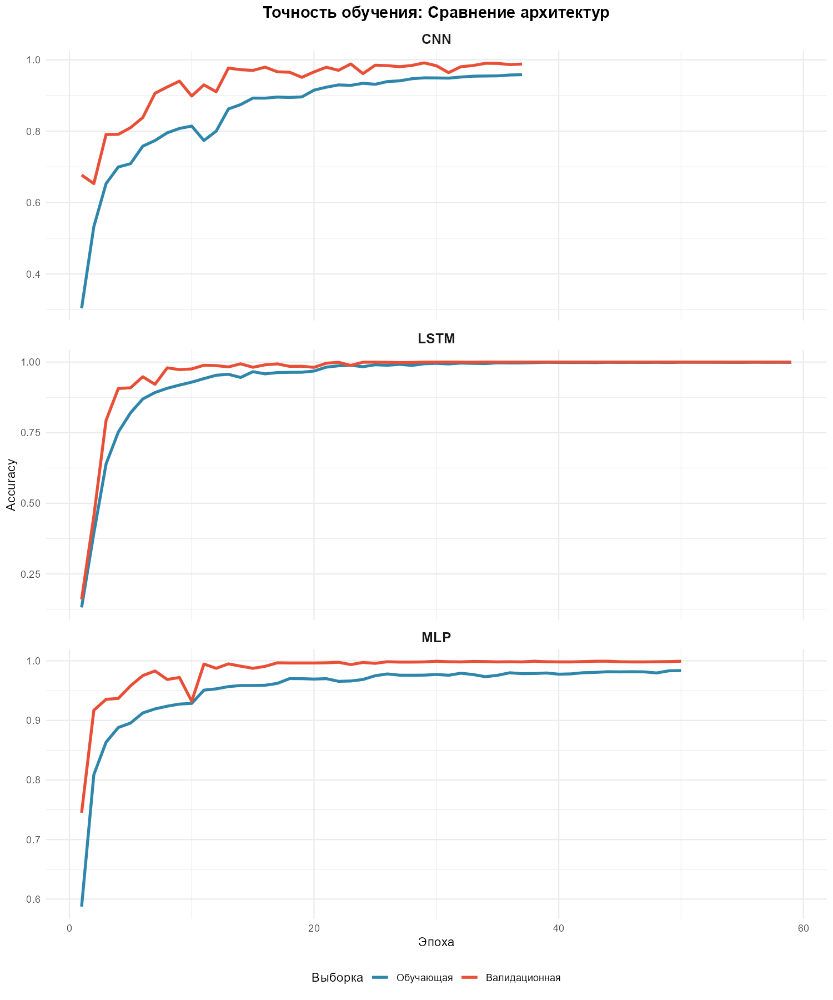
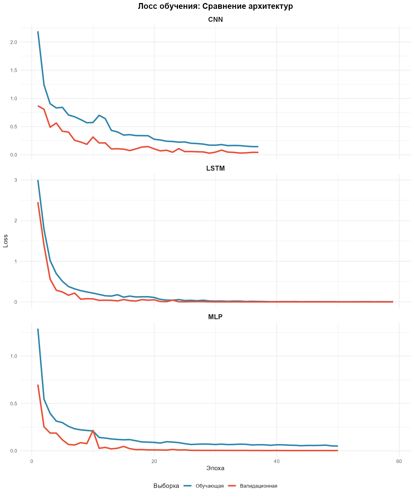
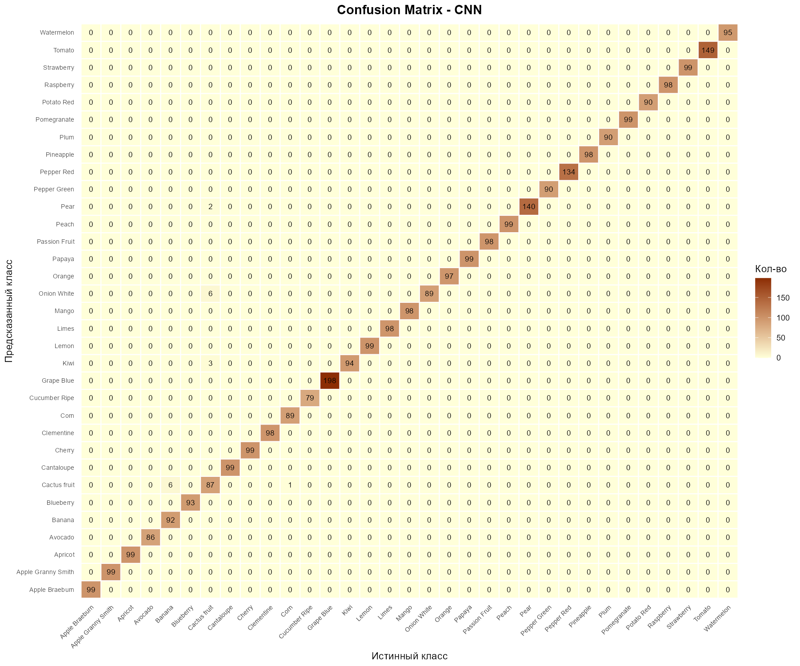

# Сравнение архитектур MLP, CNN, LSTM на задаче классификации изображений фруктов

Классификация изображений фруктов тремя архитектурами нейронных сетей — MLP (полносвязная), CNN (свёрточная) и LSTM (рекуррентная на спиральных патчах) — при одинаковом бюджете параметров (~1.6 млн) для честного сравнения разных индуктивных смещений на одних и тех же данных.

## Результаты

| Модель | Accuracy (тест) | Лучшая эпоха | Параметры |
| --- | :-: | :-: | :-: |
| **LSTM (спиральные патчи)** | **100.0%** | 51 | 1.59 млн |
| MLP | 99.9% | 42 | 1.60 млн |
| CNN | 99.1% | 29 | 1.60 млн |

- Все три архитектуры достигли ~100% точности при одинаковом числе параметров
- CNN сходится быстрее всех, LSTM потребовалось больше всего эпох
- Нормализация и аугментация встроены в модели, ранняя остановка по val_loss с восстановлением лучших весов

## Ключевая фишка: кастомный слой SpiralPatchify

Обычно изображение подают в LSTM «в лоб» — по строкам пикселей, но строки не несут смысловой последовательности. Однако можно пойти дальше — написать **кастомный слой SpiralPatchify**:
- Изображение разбивается на патчи 16×16
- Патчи выстраиваются **по спирали от центра к периферии**
- LSTM сначала видит самую информативную центральную часть изображения, затем переходит к краям

Слой написан на Python (Keras 3) и подключён в R через `reticulate` — см. `spiral_patchify.py`.

**Итог:** именно LSTM на спиральных патчах показал лучшую точность — 100.0% на тестовой выборке.

## Ключевой вывод: почему 100% точности — это тревожный сигнал

Точность 99.1–100.0% выглядит как победа, но на деле это повод проверить датасет. Каждый класс здесь представлен 400–800 фотографиями **одного и того же физического объекта**, снятого с разных ракурсов. Отсюда три эффекта:

1. **Instance Recognition** — модели учат не категорию, а запоминают уникальные текстуры и блики конкретного фрукта
2. **Object-level leakage** — при случайном разделении фото одного фрукта попадают и в train, и в test, поэтому тест формально не независим и метрики завышены
3. **Меморизация вместо обобщения** — ёмкости ~1.6 млн параметров хватает для идеального запоминания датасета любой из архитектур

**Рекомендация:** для таких данных нужен **object-level split** (например, фрукты №1–№5 идут в train, а фрукт №6 целиком — в test). Только тогда точность упадёт до реалистичных значений, а модели выучат истинные инвариантные признаки категорий.

## Технологии

R, Keras 3, TensorFlow, reticulate, Python, tidyverse, ggplot2, caret, kableExtra

## Структура

```
02-fruit-recognition/
├── README.md              ← Вы здесь
├── analysis.Rmd           ← Исходный код анализа (R Markdown)
├── analysis.html          ← Скомпилированный отчёт
├── spiral_patchify.py     ← Кастомный слой SpiralPatchify (Python, Keras 3)
└── output/
    ├── accuracy_curve.png
    ├── loss_curve.png
    ├── confusion_matrix_MLP.png
    ├── confusion_matrix_CNN.png
    └── confusion_matrix_LSTM.png
```

## Как запустить

1. Скачайте датасет изображений фруктов (классы по отдельным папкам)
2. Поместите изображения в `Data/train/train/` (по одной подпапке на класс)
3. Установите зависимости: R — `keras3`, `reticulate`, `tidyverse`, `caret`, `kableExtra`; Python — `tensorflow` и `keras`
4. Откройте `analysis.Rmd` в RStudio
5. Нажмите **Knit** (Ctrl+Shift+K)
6. При первом запуске автоматически создастся разбиение `Data/split/` (60% train / 20% val / 20% test); повторный запуск этот шаг пропускает

Все метрики и графики в отчёте вычисляются автоматически — если переобучить модели, цифры обновятся сами.
Так как обучение трёх нейросетей - процесс трудоёмкий, он может занять **несколько часов и более**.

## Примеры визуализаций

### Кривые обучения: Accuracy и Loss





**Что это за график?**
Простыми словами: это «дневник обучения» каждой из трёх сетей: как менялись точность (верхний график) и ошибка-loss (нижний график) от эпохи к эпохе на обучении и валидации.
**Как это работает?**
Три панели — три архитектуры (MLP, CNN, LSTM). Каждая модель обучалась до 100 эпох с ранней остановкой по val_loss.
**По горизонтальной оси (X):** номер эпохи — один полный проход обучающей выборки.
**По вертикальной оси (Y):** Accuracy (верхний график) или Loss (нижний); синяя линия — обучающая выборка, красная — валидационная.
**Ключевые моменты:**
- **CNN сходится быстрее всех (лучшая эпоха ~29)** → свёрточные фильтры сразу выхватывают локальные уникальные признаки объекта
- **MLP и LSTM нужно больше эпох (42 и 51)** → им сложнее накопить те же признаки из плоских векторов и спиральных последовательностей
- **Кривые обучения и валидации слипаются и уходят в ~100%** → типичный признак меморизации датасета, а не обобщения

**Вывод**
При одинаковом бюджете параметров (~1.6 млн) все три архитектуры решают задачу почти идеально, а разница в эпохах — это «цена», которую каждое индуктивное смещение платит за запоминание. Сами кривые подсказывают: с датасетом что-то не так (см. «Ключевой вывод»).

### Confusion Matrix на тестовой выборке





**Интерпретация**

Матрицы ошибок трёх архитектур демонстрируют один общий паттерн: почти полное отсутствие off-diagonal элементов. На практике это означает, что модели не путают классы в принципе — они решают задачу распознавания конкретного экземпляра, а не обобщения категории.

**Сравнительный анализ архитектур:**

- **LSTM** демонстрирует идеальное разделение классов: все тестовые объекты корректно отнесены к своим категориям без единой ошибки. Спиральный порядок подачи патчей оказывается наиболее удачным для запоминания уникальных признаков конкретного объекта.
- **MLP** допускает минимальное число ошибок — единичные ложные срабатывания для нескольких классов. Полносвязная архитектура также способна вместить в себя всю информацию о датасете благодаря ёмкости ~1.6 млн параметров.
- **CNN** показывает наиболее заметные off-diagonal элементы: ошибки наблюдаются преимущественно между визуально схожими классами фруктов. Свёрточные фильтры, будучи эффективными для извлечения локальных признаков, одновременно теряют часть глобальной информации из-за max-pooling'а — именно это объясняет чуть более низкую итоговую точность (99.1%) по сравнению с MLP и LSTM.

**Вывод**
Ошибок настолько мало (единичные изображения из сотен), что их нечего анализировать. Для реальной задачи это аномалия — и ещё одно подтверждение того, что тест не независим от обучения из-за object-level leakage.

**Ссылка на отчёт**
https://htmlpreview.github.io/?https://github.com/Zo2uEv7lPR/data-analysis-portfolio/blob/main/02-fruit-recognition/analysis.html

## Автор

**[Вячеслав AKA Zo2uEv7lPR]**
- Telegram: @Zo2uEv7lPR
- Email: Zo2uEv7lPR@yandex.ru
