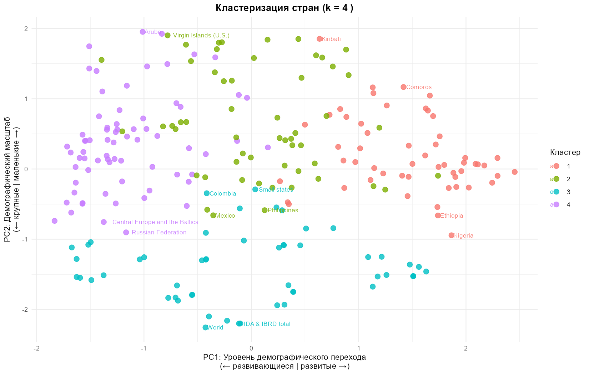
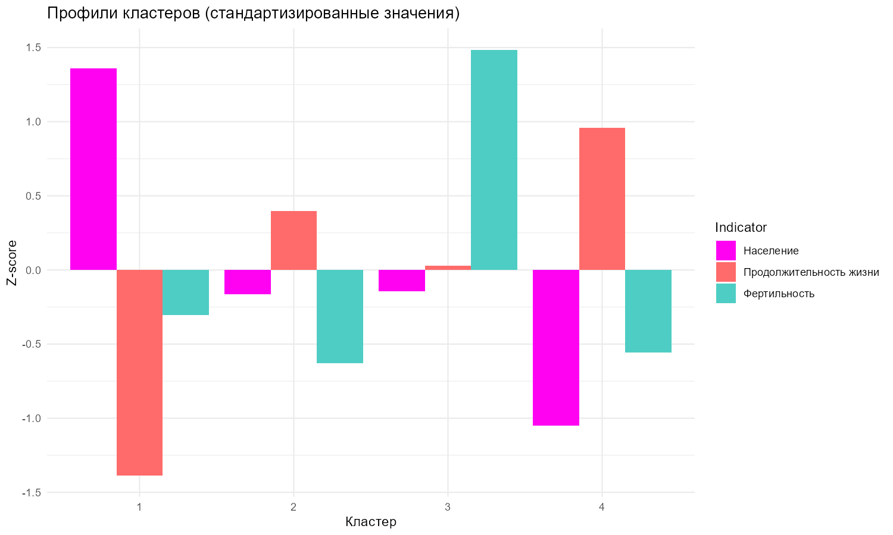
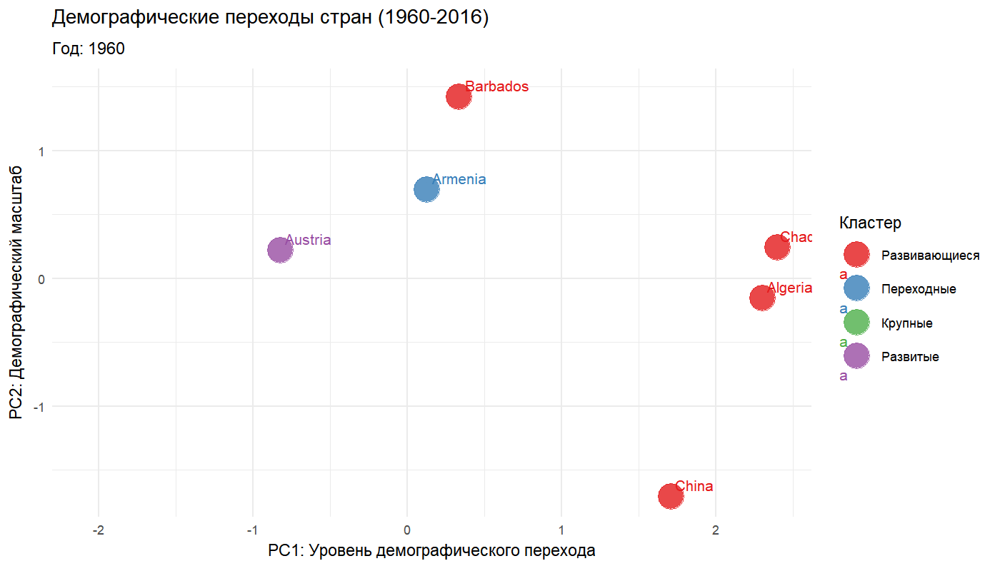
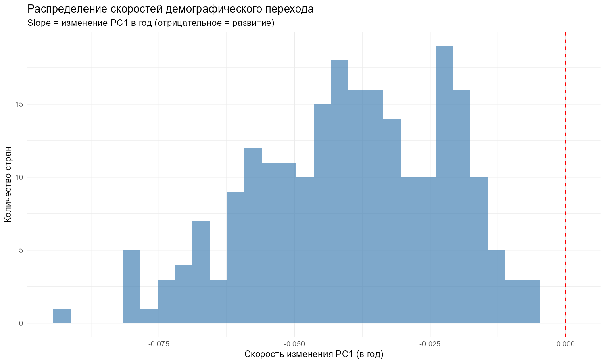
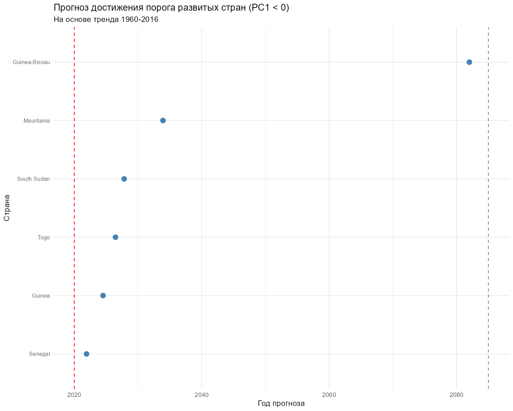

# Сегментация стран по демографическим паттернам развития (1960–2016)

Сегментация стран мира по траекториям демографического развития на данных Всемирного банка (численность населения, фертильность, ожидаемая продолжительность жизни) за 57 лет: PCA для снижения размерности, K-Means для сегментации, LDA для анализа переходов между кластерами во времени и трендовые модели для прогноза достижения порога «развитых стран».

## Результаты

| Этап | Метод | Результат |
| --- | --- | --- |
| Снижение размерности | PCA | Две интерпретируемые оси: PC1 — уровень демографического перехода, PC2 — демографический масштаб |
| Сегментация | K-Means (k = 4) | 4 кластера: развивающиеся, переходные, развитые, крупные страны |
| Валидация кластеров | ANOVA + Tukey HSD | Различия между кластерами статистически значимы по всем главным компонентам |
| Анализ переходов | LDA по годовым наблюдениям | Траектории стран и воспроизводимая классификация по годам, а не по средним |
| Прогноз | Логистический тренд (nlsLM) | Оценки года достижения порога развитых стран (PC1 < 0), горизонт до 2085 |

- Демографический переход полностью описывается двумя осями: PC1 (высокая продолжительность жизни + низкая фертильность) и PC2 (масштаб населения)
- Кластеры не статичны: за 57 лет большинство стран сменили кластер, пройдя цепочку развивающиеся → переходные → развитые
- Стабильность кластера — исключение, а не норма: лишь меньшинство стран сохранили кластер 1960 года до 2016-го

## Ключевая фишка: динамика, а не средние значения

Типовой подход к сегментации — усреднить показатели по стране и кластеризовать средние. Но средние значения теряют главное: **направление движения**. В этом проекте анализируются траектории:

- **LDA на годовых данных** — каждое наблюдение «страна-год» получает метку кластера, поэтому видна полная траектория переходов, а не только точки старта и финиша
- **Скорость перехода** — линейный тренд PC1 по году даёт сравнимую метку темпа демографического развития для каждой страны
- **Прогноз** — четырёхпараметрическая логистическая кривая, подобранная по траектории PC1, даёт оценку года пересечения порога «развитых стран»

**Вывод:** миграция между кластерами — норма, а не аномалия. Сегментация, игнорирующая динамику, теряет большую часть информации, содержащейся в данных.

## Технологии

R, tidyverse, factoextra, plotly, fmsb, cluster, gganimate, MASS, broom, patchwork, kableExtra, minpack.lm

## Структура

```
03-demographics-clustering/
├── README.md              ← Вы здесь
├── analysis.Rmd           ← Исходный код анализа (R Markdown)
├── analysis.html          ← Скомпилированный отчёт
└── output/
    ├── cluster_plot.png          ← Страны в пространстве главных компонент
    ├── cluster_profiles.png      ← Стандартизированные профили кластеров
    ├── speed_distribution.png    ← Распределение скоростей перехода
    ├── forecast.png              ← Прогноз достижения порога развитых стран
    └── cluster_transitions.gif   ← Анимация переходов между кластерами (1960–2016)
```

## Как запустить

1. Скачайте три датасета с Kaggle или World Bank Data: `country_population.csv`, `fertility_rate.csv`, `life_expectancy.csv`
2. Поместите CSV-файлы в папку `data/`
3. Откройте `analysis.Rmd` в RStudio
4. Нажмите **Knit** (Ctrl+Shift+K)
5. Получите обновлённый `analysis.html` со всеми графиками

Анимация переходов в отчёте закомментирована по умолчанию. Раскомментируйте соответствующий chunk, если хотите пересобрать `cluster_transitions.gif`.

## Примеры визуализаций

### Страны в пространстве главных компонент



**Интерпретация**

 Scatter-plot положений стран в пространстве первых двух главных компонент с окраской по принадлежности к кластерам K-Means (k = 4). PC1 разделяет развитые и развивающиеся страны по связке «продолжительность жизни + фертильность», PC2 выносит масштаб населения в отдельную ось.

**Ключевые моменты:**
- **Развивающийся кластер** занимает экстремум по PC1: высокая фертильность при низкой продолжительности жизни (Нигер, Чад, Ангола)
- **Развитый кластер** зеркален ему: низкая фертильность при высокой продолжительности жизни (Япония, Германия, Франция)
- **Переходный кластер** расположен между ними — страны в середине демографического перехода (Бразилия, Мексика)
- **Кластер крупных стран** отделён не по уровню перехода, а по PC2 — масштабу населения (Китай, США)

**Вывод**
Четыре кластера воспроизводят классические стадии демографического перехода, при этом масштаб страны выступает самостоятельной осью сегментации, ортогональной уровню развития. Выбор k = 4 подтверждён методами локтя и силуэта, а различия между кластерами проверены ANOVA с пост-хок тестами Tukey HSD.

### Стандартизированные профили кластеров



**Интерпретация**

Профили трёх индикаторов (население, продолжительность жизни, фертильность) в z-score по каждому кластеру позволяют проверить содержательность сегментации: кластеры должны различаться не одной переменной, а согласованным демографическим паттерном.

**Ключевые моменты:**
- Развивающийся и развитый кластеры зеркально противоположны по фертильности и продолжительности жизни — это и есть ось демографического перехода
- Кластер крупных стран близок к переходному по уровню перехода, но резко выделен по масштабу населения
- Профили меняются монотонно от кластера к кластеру, что подтверждает упорядоченность сегментации вдоль оси перехода

**Вывод**
Кластеры различаются системной комбинацией показателей, а не отдельной переменной: сегментация содержательна и не является артефактом метода кластеризации.

### Динамика переходов между кластерами



**Интерпретация**

Анимация показывает движение выбранных стран в пространстве PC1–PC2 с 1960 по 2016 год. Цвет точки — кластер, присвоенный LDA-моделью наблюдению страны в соответствующем году; смещение влево по PC1 соответствует движению к развитому состоянию.

**Ключевые моменты:**
- Большинство траекторий — последовательный путь развивающиеся → переходные → развитые, без перескоков через стадии
- Смена цвета вдоль траектории и есть переход между кластерами: за 57 лет большинство стран сменили кластер минимум один раз
- Стабильные траектории (без смены кластера) характерны для стран, уже находившихся на крайних стадиях перехода к 1960 году

**Вывод**
Принадлежность страны к кластеру — характеристика, меняющаяся во времени. Именно поэтому анализ построен на траекториях, а не на средних значениях: усреднение скрыло бы сам факт движения между стадиями демографического перехода.

### Скорость перехода и прогноз достижения порога развитых стран





**Интерпретация**

Скорость перехода оценивается как slope линейного тренда PC1 по году (отрицательные значения — движение в сторону развитого порога). Для прогноза по траектории PC1 каждой страны подбирается четырёхпараметрическая логистическая кривая, после чего решается задача о годе пересечения порога PC1 < 0; горизонт прогноза ограничен 2085 годом.

**Ключевые моменты:**
- Основная масса стран имеет отрицательный slope: глобальный демографический переход идёт практически повсеместно
- Разброс скоростей широк — правый хвост распределения содержит страны со стагнацией или обратным движением показателей
- Прогноз строится только для стран, чей логистический тренд фактически достигает порога: страны с асимптотой выше порога исключаются как недостижимые в рамках модели, что делает прогноз консервативным

**Вывод**
Связка линейной модели (сравнительная скорость перехода) и логистической (прогноз с насыщением) даёт и рейтинг стран по темпу развития, и прикладной ответ на вопрос «когда страна достигнет показателей развитых» — основу для планирования долгосрочных программ и инвестиций.

**Ссылка на отчёт**
https://htmlpreview.github.io/?https://github.com/Zo2uEv7lPR/data-analysis-portfolio/blob/main/03-demographics-clustering/analysis.html

## Автор

**[Вячеслав AKA Zo2uEv7lPR]**
- Telegram: @Zo2uEv7lPR
- Email: Zo2uEv7lPR@yandex.ru
